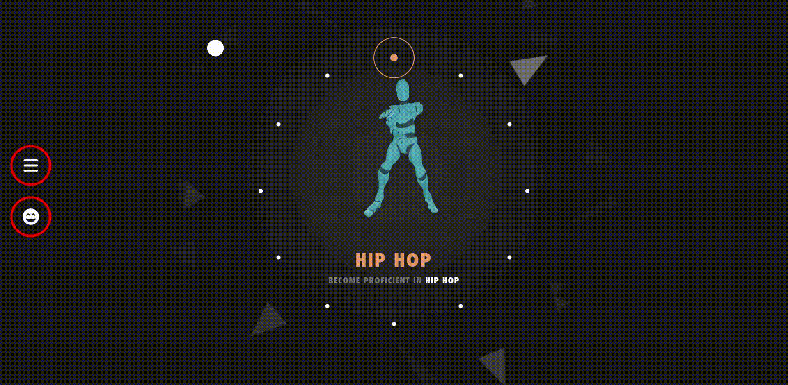
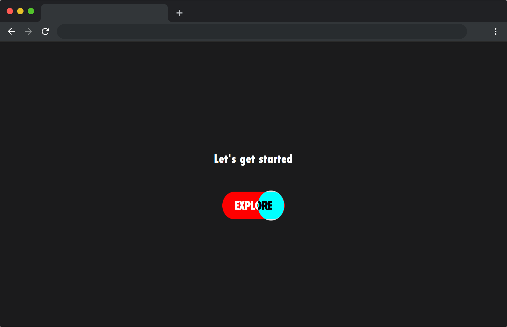
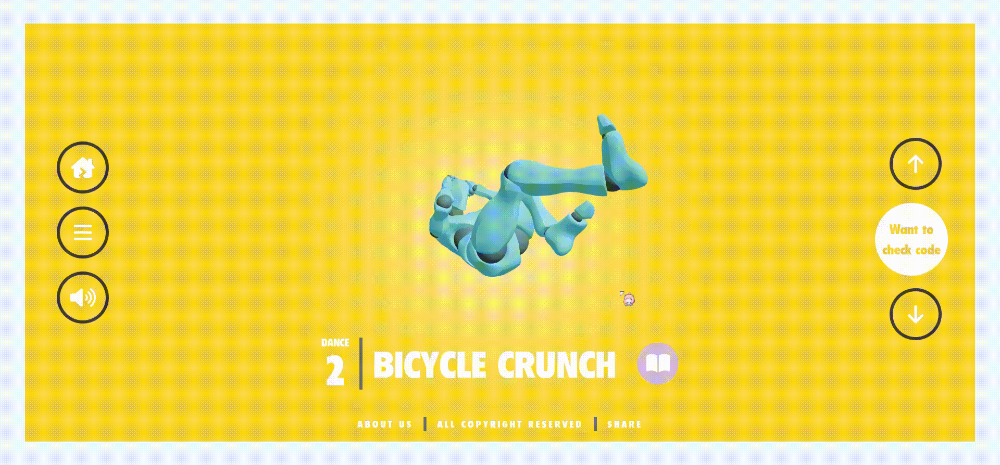
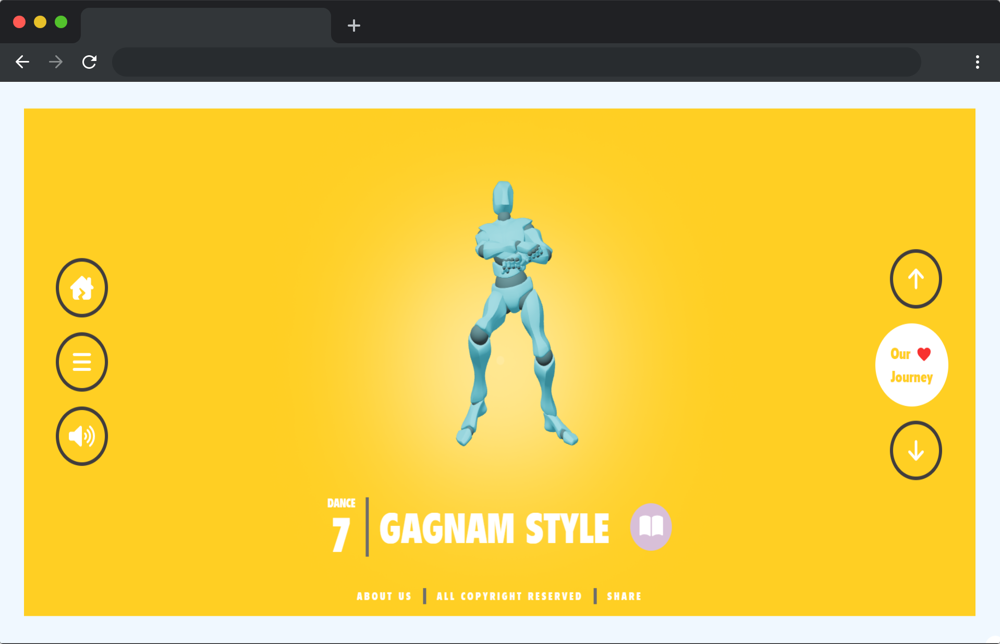
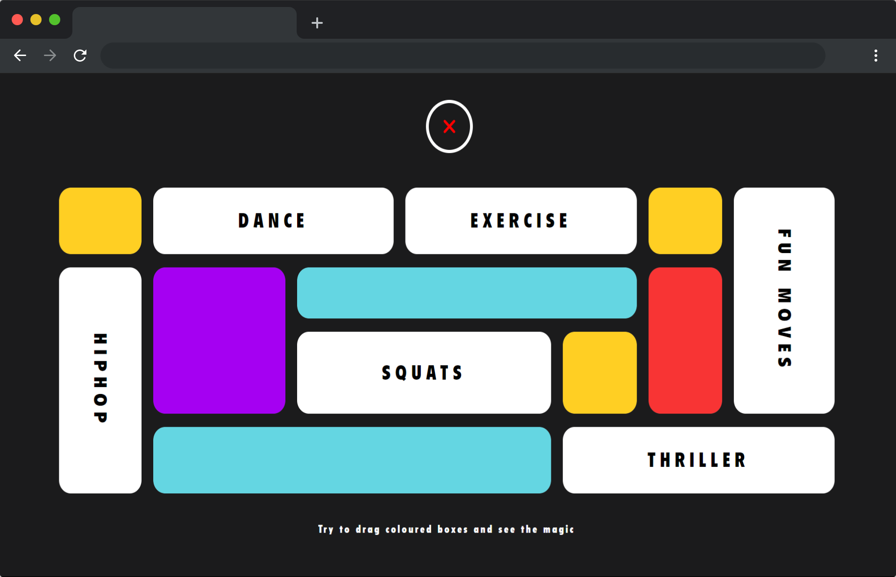

<!-- PROJECT LOGO -->
<br />
<div align="center">
  
<h1 align="center">Threecise 🥂🤖✨</h1>
  <p align="center">
   Want to learn some dance moves 💃 or some work outs 🏋️ ?? watching videos  is good but the trouble begins when you start it hard to visualise 😵
thats where Threecise comes in... learn some dance moves and workouts by a bot 🤖 in 3D how cool that sounds right🤩 !!
zoom in / out to properly focus 🧐 on a particular body movement of the excercise , rotate the bot for better visualization 👁️👄👁️ and much more..... on a single web app✨
    <br />
    <a href="https://github.com/Sourabh-Bharale/fitnessThreejs"><strong>Explore the docs »</strong></a>
    <br />
    <br />
    <a href="https://threecise.vercel.app">View Deployment </a>
    ·
    <a href="https://github.com/Sourabh-Bharale/fitnessThreejs/issues">Report Bug</a>
    .
    <a href="https://github.com/Sourabh-Bharale/fitnessThreejs/issues">Request Feature</a>
  </p>
  <strong>Like the project ( UwU ) ?? we would appreciate if you give this repo a star⭐</strong>
</div>


<!-- TABLE OF CONTENTS -->
<h2><strong><details>
  <summary>Table of Contents</summary>
  <ol>
    <li>
      <a href="#project-gallery">About The Project</a>
      <ul>
        <li><a href="#project-gallery">Project Gallery</a></li>
        <li><a href="#tech-stack">Tech Stack</a></li>
      </ul>
    </li>
    <li>
      <a href="#getting-started">Getting Started</a>
      <ul>
        <li><a href="#prerequisites">Prerequisites</a></li>
        <li><a href="#installation">Installation</a></li>
      </ul>
    </li>
    <li><a href="#resources-used-throughout-the-journey">Resources</a></li>
    <li><a href="#contributing">contributing</a></li>
    <li><a href="#creators">meet the creators</a></li>
  </ol>
</details></strong></h2>


<!-- ABOUT THE PROJECT -->
## Project Gallery

---

<div align="center">
    
 </div>

---
<table align="center">
  <tr>
    <td></td>
    <td></td>
  </tr>
  <tr>
    <td></td>
    <td></td>
  </tr>
  <tr>
    <td></td>
    <td></td>
  </tr>
</table>

---


### Tech stack

* 
* 
* 
* 


---

<!-- GETTING STARTED -->
## Getting Started

Instructions on setting up your project locally.
To get a local copy up and running follow these simple steps.

---

### Prerequisites

list things you need to use the software and how to install them.

---

* npm
  ```sh
  npm install npm@latest -g
  ```

---

### Installation

1. Clone the repo into your desired directory
   ```sh
   git clone https://github.com/Sourabh-Bharale/fitnessThreejs.git
   ```
2. Install dependencies (only the first time)
   ```sh
   npm i
   ```
3. Run the local server at localhost:3000
   ```sh
   npm run dev
   ```
   
    Now you are good to go 🚀
   
 ---
    
   Build for production in the dist/ directory
   ```sh
   npm run build
   ```
   start your optimized build at localhost:3000
   ```sh
   npm run start
   ```


<!-- USAGE EXAMPLES -->
## Resources used throughout the journey

Implementing this project was not a peice of cake...😨...faced many difficulties also experienced lack of resources on the web to do the same 😖
creating modals🤖 was some what a easy task... finding animations was somewhat time consuming ⌛ but making the animations work on a single modal was a real problem + even more troublesome as 😢 and yet still here we are🥂🤩
below are some resources we found useful during our journey 

---

<ul>
  <li><a href="https://threejs.org/docs/index.html#manual/en/introduction/Creating-a-scene">React-three</a></li>
  <li><a href="https://docs.pmnd.rs/react-three-fiber/getting-started/introduction">React-three</a></li>
  <li><a href="https://www.blender.org/">blender</a></li>
  <li><a href="https://www.mixamo.com/#/">Animations</a></li>      
</ul>

_For more examples, please refer to the [threeJS](https://threejs.org/)_

---


<!-- CONTRIBUTING -->
## Contributing

Contributions are what make the open source community such an amazing place to learn, inspire, and create. Any contributions you make are **greatly appreciated**.

If you have a suggestion that would make this better, please fork the repo and create a pull request. You can also simply open an issue with the tag "enhancement".
Don't forget to give the project a star! Thanks again!

1. Fork the Project
2. Create your Feature Branch (`git checkout -b feature/AmazingFeature`)
3. Commit your Changes (`git commit -m 'Add some AmazingFeature'`)
4. Push to the Branch (`git push origin feature/AmazingFeature`)
5. Open a Pull Request


---

<!-- CONTACT -->
## Creators

<div align="center">
    
 </div>
 <table>
  <tr>
    <td>
      <h1>Sourabh</h1>
      <ul>
        <li><a href="https://github.com/Sourabh-Bharale/"></img></a></li>
        <li><a href="https://linkedin.com/in/sourabh-bharale-a9365821a/"></img></a></li>
       <li><a href="https://instagram.com/_s0ur48h_/"></img></a></li>
       </ul>
    </td>
   <td>
       <h1>Aryan</h1>
      <ul>
        <li><a href="https://aryanjangid.in" style={{backgroundColor:"yellow", color:"white"}}>aryanjanid.in</a></li>      
        <li><a href="https://github.com/aryanjangid"></img></a></li>
        <li><a href="https://www.linkedin.com/in/jangidaryan/"></img></a></li>
       <li><a href="https://www.instagram.com/aj_aryan0007/"></img></a></li>
       </ul>
    </td>
  </tr>
  </table>

<strong>Like the project ( UwU ) ?? we would appreciate if you give this repo a star⭐</strong>


<!-- MARKDOWN LINKS & IMAGES -->
<!-- https://www.markdownguide.org/basic-syntax/#reference-style-links -->
[contributors-shield]: https://img.shields.io/github/contributors/github_username/repo_name.svg?style=for-the-badge
[contributors-url]: https://github.com/github_username/repo_name/graphs/contributors
[forks-shield]: https://img.shields.io/github/forks/github_username/repo_name.svg?style=for-the-badge
[forks-url]: https://github.com/github_username/repo_name/network/members
[stars-shield]: https://img.shields.io/github/stars/github_username/repo_name.svg?style=for-the-badge
[stars-url]: https://github.com/github_username/repo_name/stargazers
[issues-shield]: https://img.shields.io/github/issues/github_username/repo_name.svg?style=for-the-badge
[issues-url]: https://github.com/github_username/repo_name/issues
[license-shield]: https://img.shields.io/github/license/github_username/repo_name.svg?style=for-the-badge
[license-url]: https://github.com/github_username/repo_name/blob/master/LICENSE.txt
[linkedin-shield]: https://img.shields.io/badge/-LinkedIn-black.svg?style=for-the-badge&logo=linkedin&colorB=555
[linkedin-url]: https://linkedin.com/in/linkedin_username
[product-screenshot]: images/screenshot.png
[Next.js]: https://img.shields.io/badge/next.js-000000?style=for-the-badge&logo=nextdotjs&logoColor=white
[Next-url]: https://nextjs.org/
[React.js]: https://img.shields.io/badge/React-20232A?style=for-the-badge&logo=react&logoColor=61DAFB
[React-url]: https://reactjs.org/
[Vue.js]: https://img.shields.io/badge/Vue.js-35495E?style=for-the-badge&logo=vuedotjs&logoColor=4FC08D
[Vue-url]: https://vuejs.org/
[Angular.io]: https://img.shields.io/badge/Angular-DD0031?style=for-the-badge&logo=angular&logoColor=white
[Angular-url]: https://angular.io/
[Svelte.dev]: https://img.shields.io/badge/Svelte-4A4A55?style=for-the-badge&logo=svelte&logoColor=FF3E00
[Svelte-url]: https://svelte.dev/
[Laravel.com]: https://img.shields.io/badge/Laravel-FF2D20?style=for-the-badge&logo=laravel&logoColor=white
[Laravel-url]: https://laravel.com
[Bootstrap.com]: https://img.shields.io/badge/Bootstrap-563D7C?style=for-the-badge&logo=bootstrap&logoColor=white
[Bootstrap-url]: https://getbootstrap.com
[JQuery.com]: https://img.shields.io/badge/jQuery-0769AD?style=for-the-badge&logo=jquery&logoColor=white
[JQuery-url]: https://jquery.com 
